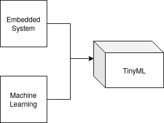
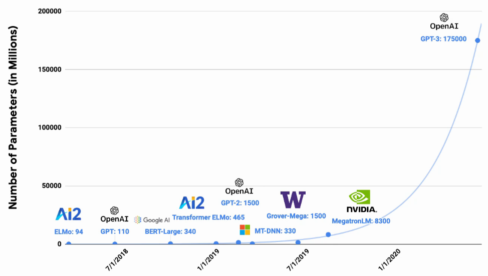
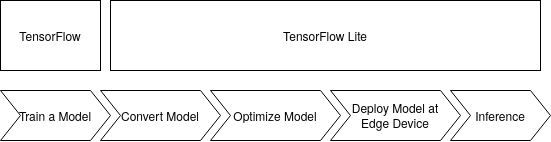
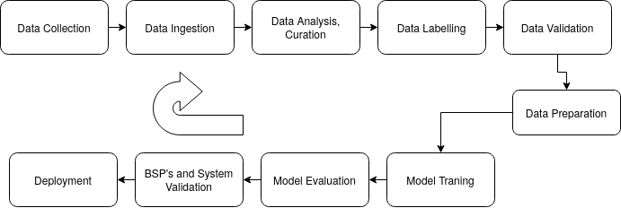
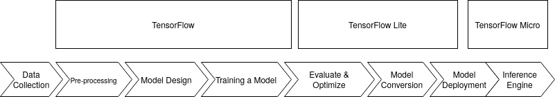

## What is Tiny Machine Learning (TinyML)
Tiny machine learning, or TinyML, is an emerging field that is at the intersection of machine learning and embedded systems. TinyML is all about taking just a small, little computing device (Micro-Controller) and enabling it with machine learning smarts. It is a fast-growing field of machine learning technologies and applications that include algorithms, hardware, and software that are capable of performing on-device sensor data analytics, doing so at extremely low power, typically in the order of milliwatts, so that we can enable always-on machine learning use cases on battery-powered devices. 

<!-- https://hbr.org/webinar/2017/04/whats-your-data-strategy -->
<!-- https://www.mckinsey.com/~/media/McKinsey/Industries/Technology%20Media%20and%20Telecommunications/High%20Tech/Our%20Insights/The%20Internet%20of%20Things%20The%20value%20of%20digitizing%20the%20physical%20world/The-Internet-of-things-Mapping-the-value-beyond-the-hype.pdf -->


## Tiny Machine Learning with Tensorflow 

<!-- Insert TinyML.png Image here  -->


While  [TensorFlow](https://www.tensorflow.org/) is written with fast custom C++ code under the hood, it has a high level Python API. A custom neural network using Tensorflow, [TensorFlow Lite](https://www.tensorflow.org/) and [TensorFlow Micro](https://www.tensorflow.org/lite/microcontrollers)

<!-- Insert Integration TinyML image here  -->


TinyML helps to provide a unique solution by summarizing and analyzing data at the edge on low power embedded devices, TinyML can provide smart summary statistics that take these previously lost patterns, anomalies, and advanced analytics into account. 

## What it takes to Enable TinyML

[Okay Google](https://support.google.com/websearch/answer/2940021?co=GENIE.Platform%3DAndroid&hl=en), [Hey Siri](https://machinelearning.apple.com/research/hey-siri), [Alexa](https://developer.amazon.com/en-US/alexa) are all successful applications of TinyML, where the devices are used as Inference engine, designed to react to perform an action for a specific set of intructions to showcase output, or act as inference engine.

<!-- Insert EnableTinyML.png image here  -->


### Input to the Embedded Systems enabled ML
Usually the input to the above mechanism are sensors, these can be Motion Sensors, Acoustic Sensors, Temperature, Humidity, environment sensorss, touchscreen input, Cameras, Biometric sensors and force or rotation sensors. 

### Processing Input 
In the simple example of alexa this can be a audio input or incasse of a Robot this can be an Inertial Measurement Unit sensor. Usually the objective of these small processors on these embedded devices to act a inference engine in Milliwatts range, to either send the analysis undertaken over to the clouds or some servers usually deisgned to perform Software as a service. 

### Generating Output Post Processing 

In have physical actuation by, like, activating servos, for instance. Or one might be able to trigger speakers, generate some kind of signal. In the case "Hey, Siri," that's effectively what we're doing. The machine is waking up and it might say "hello" or something to that effect. But it's not always about physical actuation of physical devices.One can also have digital actuations, that is input process
and extrapolation some kind of interesting data. And you send that digital signal out to a screen. And then that's useful information.

## Embedded Boards under analysis

Platforms | NVIDIA Jetson Nano | Arduino Nano 33 BLE  |
--- | --- | --- | 
Compute | 472 GFLOPS | 1Mhz - 400 Mhz | 
Memory | 2GB -4 GB | 2KB-512KB | 
Power | 10 W | 150 - 23.5 mW |

<!-- Insert Images of Arduino and Jetson here  -->

## Machine Learning Algorithm Challenges (Embedded Perspective)

<!-- Insert Parameter_Traning.png Image here -->


In order to get to obtain good accuracy and deisgn analysis, modern nueral network frameworks are growing in complexity from deeper neural networks to higher precision floating point arithmetic which requires astounding amount of compute power with GPU's, TPU's  and smart FPU's. These capabilities are not almost not present in ubiquitous embedded systems. 


<!-- Insert GFLOPS_VS_MODELs_Param.png -->

<!-- Source: S. Bianco, R. Cadene, L. Celona and P. Napoletano, "Benchmark Analysis of Representative Deep Neural Network Architectures," in IEEE Access, vol. 6, pp. 64270-64277, 2018, doi: 10.1109/ACCESS.2018.2877890. -->

From the above figure lets focus onto [AlexNet](https://papers.nips.cc/paper/2012/file/c399862d3b9d6b76c8436e924a68c45b-Paper.pdf), which happened in 2012 which was used to predict a thousand classes from [ImageNet](http://www.image-net.org/) data set. It had an  accuracy of 57.1%. And its model size was 61 megabytes in size. To obtain better accuracy  [VGGNet](https://arxiv.org/abs/1409.1556) came along in 2014 which boosted the accuracy to 71.5%. But with that came a boost from 60 megabytes model size to 528 megabytes.Additionally in 2015, Microsoft released [ResNet](https://arxiv.org/abs/1512.03385), residual nets with accuracy of 75.8%
while shrinking the model size as it was getting better. In order to make them both accurate and also be more cognizant of the size.

[MobileNet](https://github.com/tensorflow/models/blob/master/research/slim/nets/mobilenet_v1.md) for example is used in smartphones due to its optimization for memeory at the capacity of smaller disk usage which is hardly 17 megabytes, with 75% accuracy. The key nugget is that our little embedded microcontrollers onlyhave a few kilobytes of memory. With a few kilobytes of memory, it's an order of magnitude difference between where usually state of the art sits and how we need to cram things in.

<!-- Insert Transform.png -->


## Machine Learning Lifecycle 
A classic Machine learning course is about Statistics and algorithm development for analysis and design of Neural networks and performing tools developement to optimzie sections of the neural network but this only form the ML code box. To deploy machine learning in production environemnt has multiple inputs which can lead to multiple outputs. 

### Data Engineering 
Data engineering is all about defining what are the data requirements. It consists of 
- Defining Data requirements : Spectators, observes, Data in Male and Female voice etc. 
- Collecting Data 
- Data Labelling and Pre-processing: Data Collected can be noisy and may hamper performance for the ML Code box, this forms a vital step with direct implication on inference. 
- Data Preparation and Data Augmentation: Classical Machine Learning techniques involve splitting the data into testing, validation and training. 
- Repeat the above process 

### Model Engineering 
Model engineering is about design and performance analysis. 
- Traning ML Models: This forms the actual traning phase of the model and Weight parameterization and design. 
- Improving Traning Speeds: Deep neural networks can take days/months depending on compute capacity and hardware. Traning speed optimizations can be huge bottlenecks for TinyML. 
- Target Metrics: Metrics based on how accurate and at what resolution the expected out can satisfy product needs (Application Use case).
- Evaluation against metrics and standards: The model designed has to robust to uncertainty, which can be difficult in machine learning and more so on low power embedded devices. 
- Model Optimization: All the steps lead to model optimation and is a cyclic process which may or may not change with information from the clients using the TinyML product. 

### Model Deployment 
The Model trained at the Data Centres or with sources of higher compute have to deployed on small embedded devices
- Model Conversion: Conversion of the models can be undetaken both from model design and memory mapping. 
    - [Neural_Network_Pruning](https://towardsdatascience.com pruning-deep-neural-network-56cae1ec5505) 
    - [Precision Quantization](https://www.tensorflow.org/lite/performance/post_training_quantization) 
    - [Knowledge Distillation](https://keras.io/examples/vision/knowledge_distillation/)
- Performace and energy aware optimization: Tiny Machine Learning application have to be fast to respond. Latency Vs Accuracy can be pivotal in the success of the application and more so if power and energy usage have to be limited to the micro-controller under use. 
- Inference serving API's: Tensorflow/PyTorch/Keras are standard libraries which are used to create portable Tiny Machine Learning models. 

### Product Analytics 
This section of ML Architecture ususally consists of creating dashboards ([Tensorboard](https://www.tensorflow.org/tensorboard)), on-field evaluations and inference and optimazations. 

<!-- Insert MLPipeline.png -->


## Usecase of Tensorflow 

<!-- Inensorflow_pipeline.png -->

The figure above shows the workflow methodology we will be following for building the tinyML applications in this course. These are broken down into three main stages:

- Step 1: Collect & Preprocess Data
- Step 2: Design and Train a Model
- Step 3: Evaluate, Optimize, Convert and Deploy Model

## Steps Taken for conversion in this Project 

Assumption: A general assumption for the reader for this section, is no Tensorflow based API's are discussed here, it is assumed that a model development, neural network design and data engineering is undertakena is application specific. We have used [COCO Dataset](https://cocodataset.org/#home), and has been trained under [MobileNet for Binary Classification](https://github.com/arpit6232/visualwakeup_aesd) if the camera frame can detect to see it a person is in the frame of reference. 

### Example Conversion Process 

#### How to use TFLite Models
- Convert Model API
```
converter = tf.lite.TFLiteConverter.from_saved_model(export_dir)
tflite_model = converter.convert()
```
- Write to disk 
```
import pathlib
tflite_model_file = pathlib.Path('model.tflite')
tflite_model_file.write_bytes(tflite_model)
```
- Use a pre-saved tflite file, you then instantiate a tf.lite.Interpreter, and use the ‘model_content’ property to specify an existing model
```
interpreter = tf.lite.Interpreter(model_path=tflite_model_file)
```
- Once you’ve loaded the model you can then start performing inference with it. 
```
# Get input and output tensors.
input_details = interpreter.get_input_details()
output_details = interpreter.get_output_details()
to_predict = # Input data in the same shape as what the model expects
interpreter.set_tensor(input_details[0]['index'], to_predict)
tflite_results = interpreter.get_tensor(output_details[0]['index'])
```

#### Quantization Aware Training 
There are two primary forms of quantization -- [post training quantization](https://www.tensorflow.org/lite/performance/post_training_quantization) where, as part of the conversion process, your model’s internal weights and ops get converted to int8 and uint8 and [quantization aware training](https://www.tensorflow.org/model_optimization/guide/quantization/training)

To further optimize your model, we explored quantization aware training. These concepts are explained in detail later in this README

Model | Non-quantized Top-1 Accuracy | 8-bit Quantized Accuracy  |
--- | --- | --- | 
MobilenetV1 224 | 71.03% | 71.06% | 
Resnet v1 50 | 76.3% | 76.1% | 
MobilenetV2 224 | 70.77% | 70.01% |

##### Post Training Quantization 

<!-- Insert Post_training_quantization.png -->


Reducing Float Numbers to int8 can lead upto 4X reduction in memory. In a machine learning inference engine like Arduno BLE 33 has 256 KB of RAM is not entirely accessible for user space programs to use. Thus having minimum size of the machine learning model is crutial. This mathematical papers dives deeper into how Gaussian analysis proves that this conversion holds ([Resarch_Paper](https://arxiv.org/abs/1510.00149)), which also talks that it speeds up inferece making. 

In summary, 
Doing Calculations in 8-bit integers offers some compelling advantages:
- Faster arithmatic: Fewer gates to implement. 
- Lower memory demands.
- Reduces resource requirements: Many low-end micro-controllers and DSP's lack floating-point hardware, so avoiding floats increases portability. 

##### Quantization Aware Training
Post tranining quantization leaks error into inference due to loss of precision.[Quantization-aware training](https://blog.tensorflow.org/2020/04/quantization-aware-training-with-tensorflow-model-optimization-toolkit.html) effectively emulates the inference-time quantization behavior by creating a model the downstream tools will use to produce the actual quantized models. The quantized models, naturally, will be using lower precision.

So in order to introduce the error into the training graph to become resilient to them later, what we want to do is we want to modify the original neural network graph that we typically have in floating-point values so that when we're doing the computations, we are implicitly quantizing the values. And when we do the calculations, the natural output that goes out when we're doing the weights times the inputs plus the biases, that computation effectively should have the error
that we are going to have in the post-training quantization. And by injecting that error directly into the training pipeline, what happens is a network is only seeing that error be propagated through. And so when it does its back propagation and it does its gradient descent and the loss functions are working on it,it's naturally going to try and become resilient to that issue.

And so effectively, by exposing the training pipeline to the error, we're going to be able to naturally get the neural network to learn to improve its accuracy by itself.

## Why are 8-Bits are Enough for ML?
During training neural networks the biggest challenge is getting them to work at all. That means tackling accuracy and speed. Using floating-point arithmetic was the easiest way to preserve accuracy, and GPUs were well-equipped to accelerate those calculations, so it’s natural that not much attention was paid to other numerical formats.

Floating Point Arithmatic is generally not present on ubiquitus micro-controllers. That is where quantization comes in. It’s an umbrella term that covers a lot of different techniques to store numbers and perform calculations on them in more compact formats than 32-bit floating-point.

### Why does Quantization Work 
Neural networks are trained through stochastic gradient descent. These small increments typically need floating-point precision to work, otherwise, one can get yourself into a pickle with such things as “vanishing gradients.”. Taking a pre-trained model and running inference is very different. One can think about recognizing an object in a photo you’ve just taken, the network has to ignore all the CCD noise, lighting changes, and other non-essential differences between it and the training examples it’s seen before, and focus on the important similarities instead.

This ability means that they seem to treat low-precision calculations as just another source of noise, and still produce accurate results even with numerical formats that hold less information. One can run many neural networks with eight-bit parameters and intermediate buffers (instead of full precision 32-bit floating-point values), and suffer no noticeable loss in the final accuracy. There might suffer a little bit of loss in accuracy but often the gains you get in terms of performance latency and memory bandwidth are justifiable.  

### Why Quantize 
- Quantization is to shrink file sizes by storing the min and max for each layer and then compressing each float value to an eight-bit integer representing the closest real number in a linear set of 256 within the range. This means you can get the benefit of a file on disk that’s shrunk by 75%, and then convert back to float after loading so that your existing floating-point code can work without any changes.

- Reduction in computational resources to do the inference calculations, by running them entirely with eight-bit inputs and outputs is much more profitable financially and for engineering. 

## Tensorflow Vs Tensorflow Lite 

To do justice to this revolutionary topic, this article [Medium](Understand TensorFlow by mimicking its API from scratch). Exaplins the difference between tensorFlow and TensorFlow Lite. 

# Visual Wake Works 
In this project, the objective is to use a camera attached to the Arduino BLE 33 (Micro-controller) to detect a person in the key-frame. 

### Visual Wake Works Dataset 
Visual Wake Words is used to embedded and computer science realm to speak of activating a device to perform some action upon visualizing (through a camera) on an embedded platform. 

#### Data Collection and Pre-Processing 
Microsoft MSCOCO Dataset is used here for training MobileNet and transfer learning is used over TensorFlow 2.0, using [Visual Wake Words Dataset](https://arxiv.org/abs/1906.05721). 

#### Neural Network Design for Visual Wake Words
We want a network that is small and parameters and to make sure it runs efficiently. [MobileNet](https://arxiv.org/abs/1704.04861) is an industry standards generally used on smart phones and is tested to work with over 70% accuracy with low memory requirements and is used in this project. 

Model | Size | Top-1 Accuracy  |
--- | --- | --- | 
MobilenetV1 224 | 16 MB | 71.3% | 

- Further Optimization Undertaken 
    - [Depth Multiplier Convolution](https://paperswithcode.com/method/depthwise-convolution)
    - Alpha Optimization - which controlls number of paramters needed to define the model vs accuracy. 
    - [Neural Architecture Search](https://paperswithcode.com/task/architecture-search)

#### Metrics for Visual Wake Words (Evaluation)
Qualitative and quantitative metrics for VWW applications which is fairly commonly used in Computer Vision applications, which are Latency vs Accuracy tradeoffs, Fairness and Variety of Dataset collected. 


